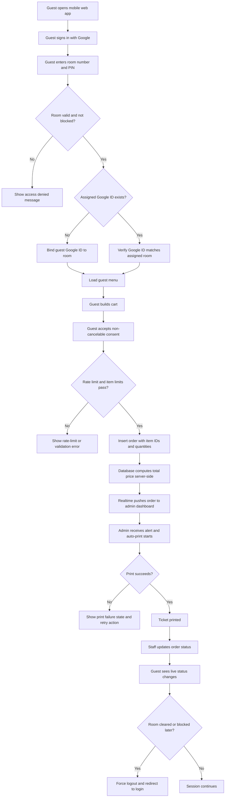

## 1. Product Overview
Hotel Room Service is a mobile-first ordering web app for hotel guests and a desktop operations dashboard for reception staff. It streamlines in-room ordering, live order tracking, and automatic thermal ticket printing without requiring a dedicated native app.

- The product solves slow or error-prone room service ordering by replacing phone-based requests with a secure self-service flow tied to Google identity and room PIN verification.
- The product creates operational value by reducing manual order intake, improving status visibility, and enabling instant KOT/BOT printing for kitchen and service staff.

## 2. Core Features

### 2.1 User Roles
| Role | Registration Method | Core Permissions |
|------|---------------------|------------------|
| Guest | Google OAuth + room number + 4-digit PIN | Browse available menu items, place rate-limited room service orders, view live order status, maintain only their own room session |
| Reception/Admin | Authenticated admin account | View live order queue, update order status, reprint tickets, manage rooms, manage menu, view sales reports, operate printer connection |

### 2.2 Feature Modules
1. **Guest Login**: Google sign-in, room verification, first-login room binding, blocked-room enforcement, live session invalidation.
2. **Guest Menu & Cart**: Category filtering, availability-aware browsing, quantity controls, live total preview, cart validation.
3. **Guest Checkout & Status**: Non-cancelable consent checkbox, rate-limit enforcement, order submission, realtime status tracking.
4. **Admin Live Queue**: New-order notifications, auto-printing, fallback retry actions, order state actions, printer connectivity state.
5. **Admin Room Management**: Assign/reset PINs, check out rooms, block or unblock rooms, clear Google assignment on checkout.
6. **Admin Menu Management**: Add, edit, remove, and toggle menu item availability.
7. **Admin Reporting**: Daily and historical sales summaries, order counts, room activity insights.

### 2.3 Page Details
| Page Name | Module Name | Feature Description |
|-----------|-------------|---------------------|
| Guest Login | Google OAuth panel | Starts Google authentication and handles post-auth session restoration |
| Guest Login | Room verification form | Collects room number and 4-digit PIN, validates against Supabase, binds Google ID on first success |
| Guest Login | Session guard | Detects blocked rooms or invalidated room assignments and prevents entry |
| Guest Menu | Category tabs | Filters food, beverage, and amenities by selected category |
| Guest Menu | Item cards | Shows item title, price, availability, and quantity controls; hides unavailable items |
| Guest Menu | Sticky cart summary | Displays item count, running total, and checkout entry point |
| Guest Checkout | Cart review list | Shows selected items, quantities, per-line prices, and computed display total |
| Guest Checkout | Consent gate | Requires explicit acknowledgment that orders cannot be canceled |
| Guest Checkout | Submit controls | Enforces room block state, order interval rule, and maximum 5 items per order |
| Guest Status | Timeline view | Shows live status progression from placed to preparing to delivered |
| Guest Status | Session invalidation listener | Logs the guest out if room assignment is cleared or the room becomes blocked |
| Admin Dashboard | Printer status bar | Shows WebUSB capability, connected device state, and connect button |
| Admin Dashboard | Browser support banner | Warns when the browser lacks `navigator.usb` support |
| Admin Dashboard | Live order queue | Streams new orders in realtime, highlights unprinted failures, and keeps newest orders visible |
| Admin Dashboard | Order action controls | Supports mark as preparing, mark as delivered, cancel order, and manual reprint |
| Admin Dashboard | Alert system | Plays audio cues and shows visual alerts for new orders and print failures |
| Admin Rooms | Room table | Lists room assignment, PIN state, block status, and quick actions |
| Admin Rooms | Room actions | Resets PINs, blocks or unblocks rooms, and checks guests out by clearing assigned Google ID |
| Admin Menu | Item editor | Creates and edits title, category, price, and availability |
| Admin Menu | Availability toggles | Quickly enables or disables orderable items |
| Admin Reporting | Daily summary cards | Shows sales totals, order count, average order value, and cancellation count |
| Admin Reporting | Historical views | Filters previous days or date ranges for trend review |

## 3. Core Process
Guests authenticate with Google, prove room possession using a room PIN, and become bound to that room on first successful login. Once authenticated, they browse only currently available menu items, build a cart, acknowledge the non-cancelable policy, and submit an order that is validated and priced server-side before being written to Supabase.

Admins keep a desktop dashboard open with realtime order subscriptions. New orders trigger sound and visual alerts, then auto-print to an 80mm thermal printer through WebUSB. Staff update each order through preparing, delivered, or canceled states, and those changes immediately appear on the guest status screen.

If a guest is checked out or blocked while their session is active, the app receives a realtime update on the `rooms` row, invalidates the session, and returns them to login. If printer pairing is unavailable or printing fails, the dashboard shows a clear failure state and a manual retry action.

## 4. User Interface Design
### 4.1 Design Style
- Primary colors: deep charcoal, ivory, and warm amber to suggest hospitality, urgency, and print-ready clarity.
- Accent colors: emerald for success, crimson for printer failure, cobalt for active status actions.
- Button style: rounded-rectangle controls with strong contrast, dense labeling, and large touch targets on mobile.
- Typography: elegant hospitality-forward display font for headings paired with a highly legible sans-serif body font for operational content.
- Layout style: mobile-first stacked layout for guests; dense desktop split-panel dashboard for admins with persistent action surfaces.
- Icon style suggestions: outlined service and operations icons from Lucide, paired with color-coded state badges.

### 4.2 Page Design Overview
| Page Name | Module Name | UI Elements |
|-----------|-------------|-------------|
| Guest Login | Authentication panel | Hotel branding, welcome copy, Google sign-in button, room form, inline validation, blocked-state messaging |
| Guest Menu | Menu catalog | Sticky category pills, card grid or list, quantity steppers, availability badges, floating checkout bar |
| Guest Checkout | Review screen | Order summary cards, consent checkbox, disabled primary action until validated, rate-limit helper text |
| Guest Status | Live tracker | Status stepper, timestamp cards, support note, automatic refresh via realtime state |
| Admin Dashboard | Queue panel | Desktop card list, urgent color states, print status chips, loud retry action, action button row |
| Admin Dashboard | Printer connection header | Connectivity indicator, browser support banner, connect button, test print or reconnect affordance |
| Admin Rooms | Management table | Searchable rows, block badges, PIN reset action, checkout action, confirmation flows |
| Admin Menu | CRUD editor | Table with inline edit or modal form, category selector, availability switch, price formatting |
| Admin Reporting | Summary panels | KPI cards, date filters, charts or grouped tables for historical review |

### 4.3 Responsiveness
- Guest experience is mobile-first, optimized for one-hand use, thumb-friendly controls, and small-screen checkout clarity.
- Admin experience is desktop-first, optimized for reception workstations with large order cards and persistent printer controls.
- Shared components adapt across breakpoints, but admin pages prioritize wide-screen layouts and guests prioritize compact touch interactions.
- Hash-based routing preserves deep-link reload behavior on GitHub Pages.

## 5. Functional Constraints And Rules
- Guests can only place orders for the room bound to their Google identity after successful PIN verification.
- Guests cannot place orders when their room is blocked.
- Guests cannot submit more than one order within a 10-minute window for the same room.
- Guests cannot submit more than 5 total item units per order unless an explicit future policy change is made.
- Client-submitted totals are ignored; server-side logic computes the authoritative total from current menu pricing.
- Guests cannot cancel orders after submission from the guest portal.
- Admins can reprint any order and must see a prominent retry state after any print failure.
- The app must detect browsers without WebUSB support and warn admins persistently.

## 6. Success Metrics
- Guests complete room-bound authentication with low friction and cannot access or order for another room.
- Every accepted order appears in the admin queue in realtime and is either auto-printed or clearly marked for retry.
- Order status changes propagate to the guest view without refresh.
- Security rules are enforced at the database layer through RLS, trigger logic, and constrained insert behavior.
