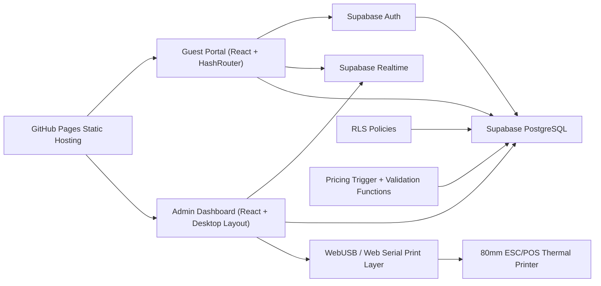
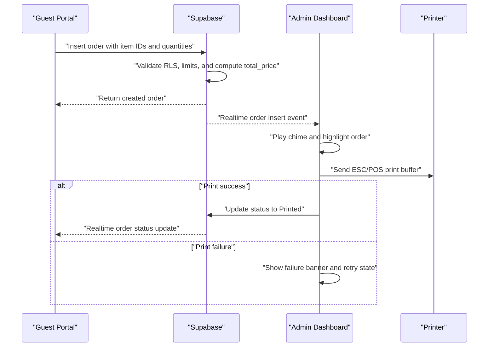
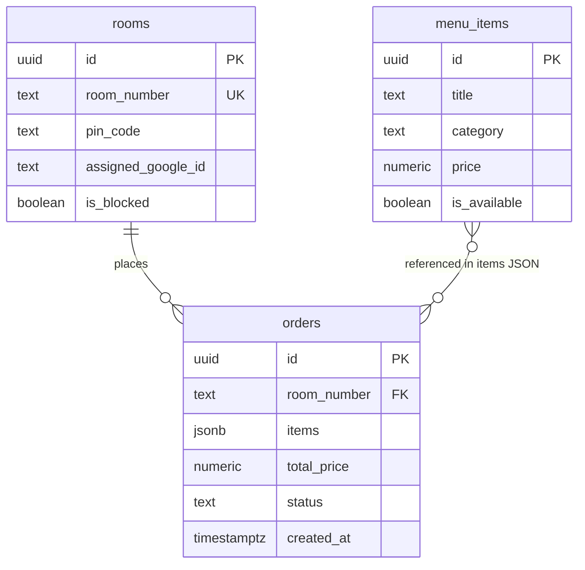

## 1. Architecture Design


## 2. Technology Description
- Frontend: React 18 + TypeScript + Vite + Tailwind CSS + Lucide React + HashRouter
- State and data: Supabase JavaScript client, React Context for auth/session, custom hooks for realtime subscriptions
- Backend platform: Supabase Auth, PostgreSQL, Realtime, Row Level Security, SQL functions and triggers
- Hosting: GitHub Pages static deployment with SPA fallback handled through hash-based routing
- Printing: WebUSB first, optional Web Serial compatibility adapter if required by printer model, `esc-pos-encoder` for ESC/POS command generation
- Tooling: ESLint, TypeScript strict mode, PostCSS, GitHub Actions for build-and-deploy automation

## 3. Route Definitions
| Route | Purpose |
|-------|---------|
| `/` | Entry route that redirects by session role and room binding status |
| `/login` | Guest login and room verification screen |
| `/menu` | Guest menu browsing and cart management |
| `/checkout` | Guest cart review, consent confirmation, and order submission |
| `/status` | Guest live order status timeline |
| `/admin` | Admin dashboard shell and printer connectivity status |
| `/admin/orders` | Admin live order queue with printing and status actions |
| `/admin/rooms` | Room management for PINs, blocks, and checkout |
| `/admin/menu` | Menu CRUD and availability management |
| `/admin/reports` | Sales overview with daily and historical summaries |

## 4. Frontend Architecture
### 4.1 Application Structure
- `src/app`: top-level app shell, router, providers, auth bootstrapping
- `src/features/guest-auth`: Google sign-in flow, room verification, session guards
- `src/features/menu`: menu listing, category filters, cart controls
- `src/features/orders`: checkout submission, status timeline, order history queries
- `src/features/admin-orders`: live queue, auto-print, retry print, status action handlers
- `src/features/admin-rooms`: room lookup, PIN reset, block/unblock, checkout actions
- `src/features/admin-menu`: menu CRUD forms and tables
- `src/features/reports`: daily and historical sales summaries
- `src/lib/supabase`: client creation, typed queries, auth helpers, realtime channels
- `src/lib/printing`: printer capability detection, device pairing, receipt formatter, print transport
- `src/components`: shared UI atoms, cards, badges, dialogs, banners, audio alerts

### 4.2 State Strategy
- Supabase remains the source of truth for auth, room assignment, menu data, and orders.
- Local component state handles cart editing, temporary form input, and printer connection UI.
- Session context stores authenticated user data, bound room metadata, and forced logout state.
- Realtime hooks subscribe to room assignment changes and order status changes for instant UI updates.
- Admin print state tracks per-order ticket status such as `idle`, `printing`, `printed`, and `failed`.

### 4.3 Role-Based Navigation
- Guest users are routed only to guest routes and are redirected to `/login` if auth or room binding checks fail.
- Admin users are routed to `/admin/orders` by default after authentication.
- Shared route guards validate Supabase session, room state, and role claims before rendering protected screens.

## 5. API And Data Contracts
Although the app is primarily client-to-Supabase, the following TypeScript contracts define the authoritative data shape consumed by the frontend.

```ts
export type Room = {
  id: string;
  room_number: string;
  pin_code: string;
  assigned_google_id: string | null;
  is_blocked: boolean;
};

export type MenuItem = {
  id: string;
  title: string;
  category: 'Food' | 'Beverage' | 'Amenities';
  price: number;
  is_available: boolean;
};

export type OrderItemInput = {
  item_id: string;
  quantity: number;
};

export type OrderStatus =
  | 'Pending'
  | 'Printed'
  | 'Preparing'
  | 'Delivered'
  | 'Completed'
  | 'Canceled';

export type Order = {
  id: string;
  room_number: string;
  items: OrderItemInput[];
  total_price: number;
  status: OrderStatus;
  created_at: string;
};
```

### 5.1 Guest Login Flow Contract
```ts
type GuestRoomVerificationRequest = {
  roomNumber: string;
  pinCode: string;
  googleId: string;
};

type GuestRoomVerificationResult = {
  room: Room;
  isFirstBinding: boolean;
};
```

### 5.2 Order Submission Contract
```ts
type CreateOrderRequest = {
  roomNumber: string;
  items: Array<{
    item_id: string;
    quantity: number;
  }>;
};

type CreateOrderResponse = {
  id: string;
  status: 'Pending';
  total_price: number;
  created_at: string;
};
```

### 5.3 Admin Status Update Contract
```ts
type UpdateOrderStatusRequest = {
  orderId: string;
  status: 'Preparing' | 'Delivered' | 'Completed' | 'Canceled' | 'Printed';
};
```

## 6. Realtime Event Design
- Guest app subscribes to its own `rooms` row using `postgres_changes` for updates on `assigned_google_id` and `is_blocked`.
- Guest app subscribes to `orders` filtered by the current room number to update order status in realtime.
- Admin dashboard subscribes to new `orders` inserts and relevant updates to reflect print retries and staff status changes.
- Audio alert logic is client-side and rate-limited to avoid notification storms during reconnects or snapshot syncs.



## 7. Security Architecture
### 7.1 Authentication And Role Model
- Guests authenticate with Google through Supabase Auth.
- Admins authenticate through Supabase Auth and must carry an admin role claim or belong to a separately protected admin user table.
- Guest authorization depends on both auth identity and room-binding validation.

### 7.2 RLS Principles
- RLS is enabled on `rooms`, `menu_items`, and `orders`.
- Guests can select only menu items marked available for ordering.
- Guests cannot freely select all room data; they only access the room record bound to their Google identity and current room workflow.
- Guests can insert orders only for their bound room number.
- Guests cannot update or delete orders.
- Admins can read and manage all operational tables.
- Policies enforce block status and room ownership checks server-side.

### 7.3 Abuse Prevention
- Order creation is rejected if the same room already placed an order within the past 10 minutes.
- Order payload is rejected if total quantity exceeds 5 items.
- Menu IDs in the order payload must exist and be currently available at insert time.
- Pricing is recalculated on insert regardless of client input.

## 8. Server-Side SQL Design
### 8.1 Data Model Definition


### 8.2 Data Definition Language
```sql
create extension if not exists pgcrypto;

create table if not exists public.rooms (
  id uuid primary key default gen_random_uuid(),
  room_number text not null unique,
  pin_code text not null check (pin_code ~ '^[0-9]{4}$'),
  assigned_google_id text null,
  is_blocked boolean not null default false
);

create table if not exists public.menu_items (
  id uuid primary key default gen_random_uuid(),
  title text not null,
  category text not null check (category in ('Food', 'Beverage', 'Amenities')),
  price numeric(10,2) not null check (price >= 0),
  is_available boolean not null default true
);

create table if not exists public.orders (
  id uuid primary key default gen_random_uuid(),
  room_number text not null references public.rooms(room_number) on update cascade,
  items jsonb not null,
  total_price numeric(10,2) not null default 0,
  status text not null default 'Pending' check (status in ('Pending', 'Printed', 'Preparing', 'Delivered', 'Completed', 'Canceled')),
  created_at timestamptz not null default now()
);

create index if not exists idx_orders_room_number_created_at
  on public.orders(room_number, created_at desc);

create index if not exists idx_orders_status_created_at
  on public.orders(status, created_at desc);

create index if not exists idx_menu_items_available_category
  on public.menu_items(is_available, category);
```

### 8.3 Helper Functions
```sql
create or replace function public.current_google_subject()
returns text
language sql
stable
as $$
  select coalesce(auth.jwt() ->> 'sub', '');
$$;

create or replace function public.is_admin()
returns boolean
language sql
stable
as $$
  select coalesce((auth.jwt() -> 'app_metadata' ->> 'role') = 'admin', false);
$$;
```

### 8.4 Guest Room Verification Function
```sql
create or replace function public.bind_guest_room(
  p_room_number text,
  p_pin_code text,
  p_google_id text
)
returns public.rooms
language plpgsql
security definer
set search_path = public
as $$
declare
  v_room public.rooms;
begin
  select *
  into v_room
  from public.rooms
  where room_number = p_room_number
    and pin_code = p_pin_code
  for update;

  if not found then
    raise exception 'Invalid room number or PIN';
  end if;

  if v_room.is_blocked then
    raise exception 'Room is blocked';
  end if;

  if v_room.assigned_google_id is null then
    update public.rooms
    set assigned_google_id = p_google_id
    where id = v_room.id
    returning * into v_room;
  elsif v_room.assigned_google_id <> p_google_id then
    raise exception 'Room is already assigned to a different guest';
  end if;

  return v_room;
end;
$$;
```

### 8.5 Pricing And Validation Trigger
```sql
create or replace function public.compute_order_total()
returns trigger
language plpgsql
security definer
set search_path = public
as $$
declare
  v_google_id text;
  v_room public.rooms;
  v_total numeric(10,2);
  v_item_count integer;
begin
  v_google_id := public.current_google_subject();

  select *
  into v_room
  from public.rooms
  where room_number = new.room_number;

  if not found then
    raise exception 'Room does not exist';
  end if;

  if v_room.is_blocked then
    raise exception 'Room is blocked';
  end if;

  if coalesce(v_room.assigned_google_id, '') <> v_google_id then
    raise exception 'Room assignment mismatch';
  end if;

  select coalesce(sum((item.value ->> 'quantity')::int), 0)
  into v_item_count
  from jsonb_array_elements(new.items) as item(value);

  if v_item_count <= 0 or v_item_count > 5 then
    raise exception 'Orders must contain between 1 and 5 total item units';
  end if;

  if exists (
    select 1
    from public.orders o
    where o.room_number = new.room_number
      and o.created_at > now() - interval '10 minutes'
      and o.status <> 'Canceled'
  ) then
    raise exception 'Rate limit exceeded for room';
  end if;

  with order_items as (
    select
      (item.value ->> 'item_id')::uuid as item_id,
      (item.value ->> 'quantity')::int as quantity
    from jsonb_array_elements(new.items) as item(value)
  )
  select sum(mi.price * oi.quantity)
  into v_total
  from order_items oi
  join public.menu_items mi on mi.id = oi.item_id
  where mi.is_available = true;

  if v_total is null then
    raise exception 'Order contains unavailable or invalid items';
  end if;

  if (
    select count(*)
    from (
      select 1
      from jsonb_array_elements(new.items) as item(value)
      left join public.menu_items mi
        on mi.id = ((item.value ->> 'item_id')::uuid)
       and mi.is_available = true
      where mi.id is null
    ) invalid_items
  ) > 0 then
    raise exception 'Order contains unavailable or invalid items';
  end if;

  new.total_price := v_total;
  new.status := coalesce(new.status, 'Pending');
  return new;
end;
$$;

drop trigger if exists trg_compute_order_total on public.orders;

create trigger trg_compute_order_total
before insert on public.orders
for each row
execute function public.compute_order_total();
```

### 8.6 RLS Policies
```sql
alter table public.rooms enable row level security;
alter table public.menu_items enable row level security;
alter table public.orders enable row level security;

drop policy if exists "admins_manage_rooms" on public.rooms;
create policy "admins_manage_rooms"
on public.rooms
for all
to authenticated
using (public.is_admin())
with check (public.is_admin());

drop policy if exists "guest_read_own_room" on public.rooms;
create policy "guest_read_own_room"
on public.rooms
for select
to authenticated
using (assigned_google_id = public.current_google_subject());

drop policy if exists "admins_manage_menu_items" on public.menu_items;
create policy "admins_manage_menu_items"
on public.menu_items
for all
to authenticated
using (public.is_admin())
with check (public.is_admin());

drop policy if exists "guests_read_available_menu_items" on public.menu_items;
create policy "guests_read_available_menu_items"
on public.menu_items
for select
to authenticated
using (is_available = true);

drop policy if exists "admins_manage_orders" on public.orders;
create policy "admins_manage_orders"
on public.orders
for all
to authenticated
using (public.is_admin())
with check (public.is_admin());

drop policy if exists "guests_insert_own_orders" on public.orders;
create policy "guests_insert_own_orders"
on public.orders
for insert
to authenticated
with check (
  exists (
    select 1
    from public.rooms r
    where r.room_number = orders.room_number
      and r.assigned_google_id = public.current_google_subject()
      and r.is_blocked = false
  )
);

drop policy if exists "guests_read_own_orders" on public.orders;
create policy "guests_read_own_orders"
on public.orders
for select
to authenticated
using (
  exists (
    select 1
    from public.rooms r
    where r.room_number = orders.room_number
      and r.assigned_google_id = public.current_google_subject()
  )
);
```

## 9. Printing Architecture
### 9.1 Capability Flow
- On admin app load, detect `navigator.usb`.
- If unavailable, show a persistent browser support banner with Chrome and Edge guidance.
- If available, allow manual device pairing through `navigator.usb.requestDevice`.
- Persist a best-effort printer profile in local storage for reconnect hints, but always rely on browser-approved device access at runtime.

### 9.2 Receipt Formatter
- Header: hotel name and KOT/BOT title, centered.
- Emphasis: room number printed in bold, double-size text.
- Body: itemized rows with quantity, item name, unit or line pricing.
- Summary: total price and timestamp.
- Footer: non-cancelable notice and source identifier.

### 9.3 Failure Handling
- Failed auto-print transitions the order card into a `failed` visual state.
- The failed order card replaces the standard reprint button with a high-contrast retry call to action.
- The dashboard plays an alert sound and displays a full-screen red flash overlay when printing fails.
- Admins can manually reprint any existing order without changing fulfillment status.

## 10. Deployment Architecture
- Build with Vite to static assets under `dist/`.
- Deploy to GitHub Pages via GitHub Actions or manual publish.
- Use `HashRouter` so refreshes on nested routes do not require server rewrite rules.
- Configure Supabase URL and anon key through Vite environment variables exposed at build time.
- Keep all sensitive authorization and enforcement in Supabase RLS, functions, and triggers; the public anon key is acceptable only because database access is restricted by policy.

## 11. Assumptions
- Admin authentication uses Supabase Auth with a reliable role claim available in JWT `app_metadata.role`.
- The thermal printer supports WebUSB or a compatible browser-exposed interface that can accept raw ESC/POS bytes.
- Hotel staff operate the admin dashboard on Chromium-based browsers.
- The guest identity used for room binding is the Google account subject returned by Supabase Auth.
- A separate design pass can refine visual branding, but the initial implementation prioritizes clarity, reliability, and operational feedback.
